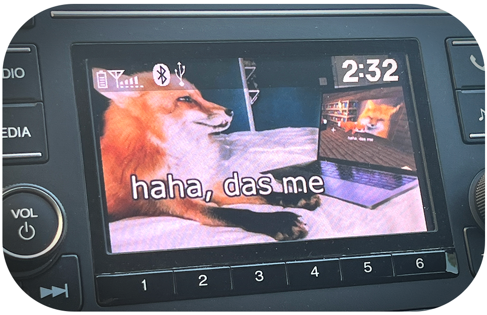

<h1>2018 Honda Civic LX Hatchback Wallpaper Creator</h1>

<strong>A CLI command/Python library to turn images to compatible wallpapers for the 2018 Honda Civic LX Hatchback!</strong>

 

# **Install**
[Coming soon]

 

# **Usage**
[Coming soon]

 

# **Principles**
## Wallpaper Requirements
1. `1024x600`is the ideal resolution. 
   - ...but _can_ be scaled up to 1920x936 or 4096x2304 pixels.  
2. Images must be `.jpg`, `.jpeg`, or `.bmp` format.
3. `24-bit color depth` (NOT 8-bit or 32-bit).
4. Images must be `smaller than  2MB`.

## USB Requirements
1. The USB must be formatted to `FAT32` or `ExFAT`.
2. The USB` must be plugged into the main USB port` of the car. 
   - It should be around the front-left of your center console, so directly to the bottom-front-right of the driver.
